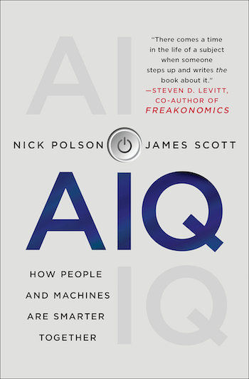

## AIQ: How People and Machines are Smarter Together

::: {.book-block}
{fig-alt="Cover of AIQ"}

::: {.book-text}

[*AIQ: How People and Machines Are Smarter Together*](https://www.amazon.com/dp/1250182158?tag=macmillan-20) was published in 2018, several years before the arrival of ChatGPT and the current wave of public attention to generative AI. We did not get everything right, but I am proud of how well the book has held up. *AIQ* tried to explain artificial intelligence as a practical, statistically driven technology rather than as science fiction, and it anticipated many questions that now feel urgent: What happens when chatbots become fluent enough to seem human? How should we think about algorithmic decision-making in hiring, finance, medicine, and public policy? What happens when both sides of a system, such as HR managers screening résumés and applicants writing them, begin using AI against each other? The book remains an accessible account of how data, prediction, and human judgment interact in the real world. For a non-technical version of how this technology actually works, and sometimes does not work, it remains relevant.
:::
:::

### Praise for *AIQ*

> “There comes a time in the life of a subject when someone steps up and writes *the* book about it.”  
> — Steven D. Levitt, co-author of *Freakonomics*

> “Nick Polson and James Scott take us under the hood of AI and data science, showing that behind most algorithms is the story of a person trying to solve a problem and make the world better.”  
> — Michael J. Casey, author of *The Age of Cryptocurrency* and *The Truth Machine*

> “At last, a book on the ideas behind AI and data science by people who really understand data.”  
> — David Spiegelhalter, Professor of the Public Understanding of Risk, University of Cambridge

## Data Science in R: A Gentle Introduction

[*Data Science in R: A Gentle Introduction*](https://bookdown.org/jgscott/DSGI/) is my free textbook on data science, used in a number of introductory classes at UT and elsewhere. The book is structured as a series of walk-through lessons in R that have students doing real data science quickly. It covers both the core ideas of data science and the concrete software skills needed to translate those ideas into practice.

Many lessons operate on the premise of “mimic first, understand later.” I introduce bits of R code that do something interesting and ask students to mimic them word for word to see what they do, without necessarily understanding every detail at first. The theory is that seeing the “what” first creates motivation to understand the “how” and “why.”
